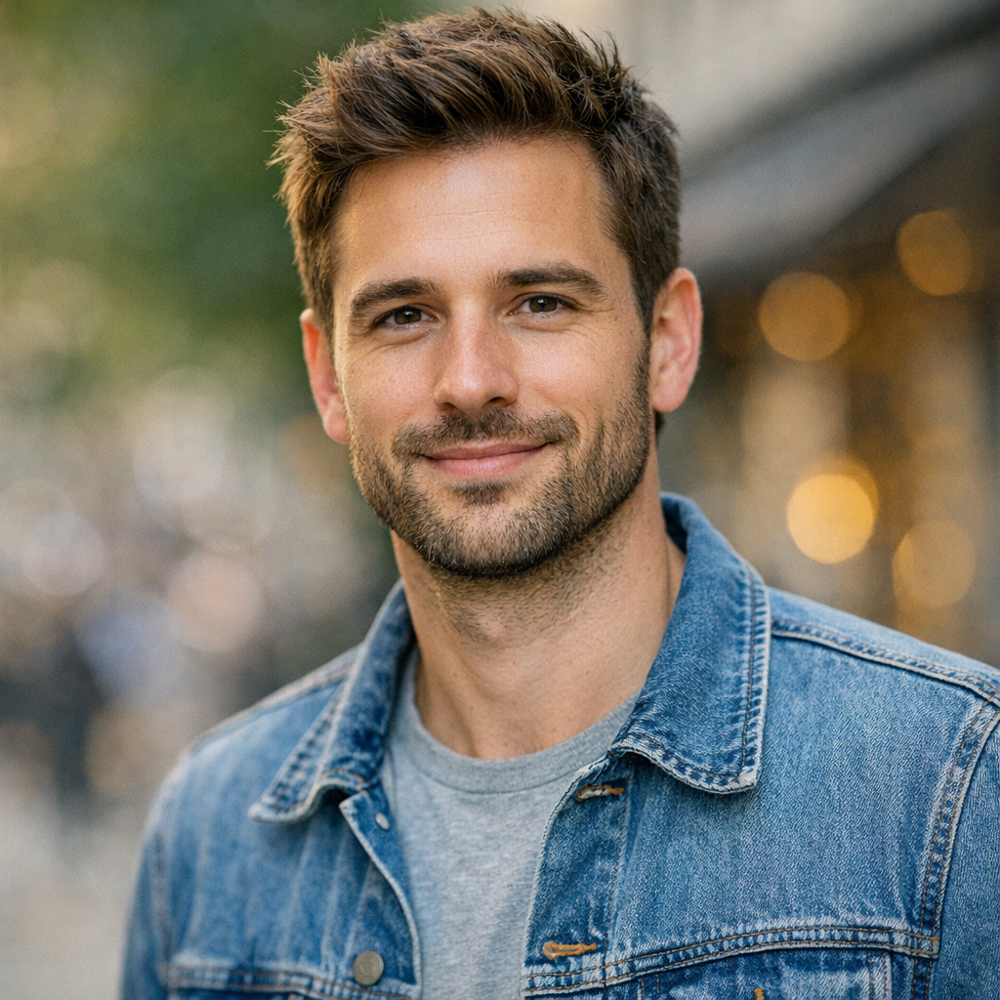
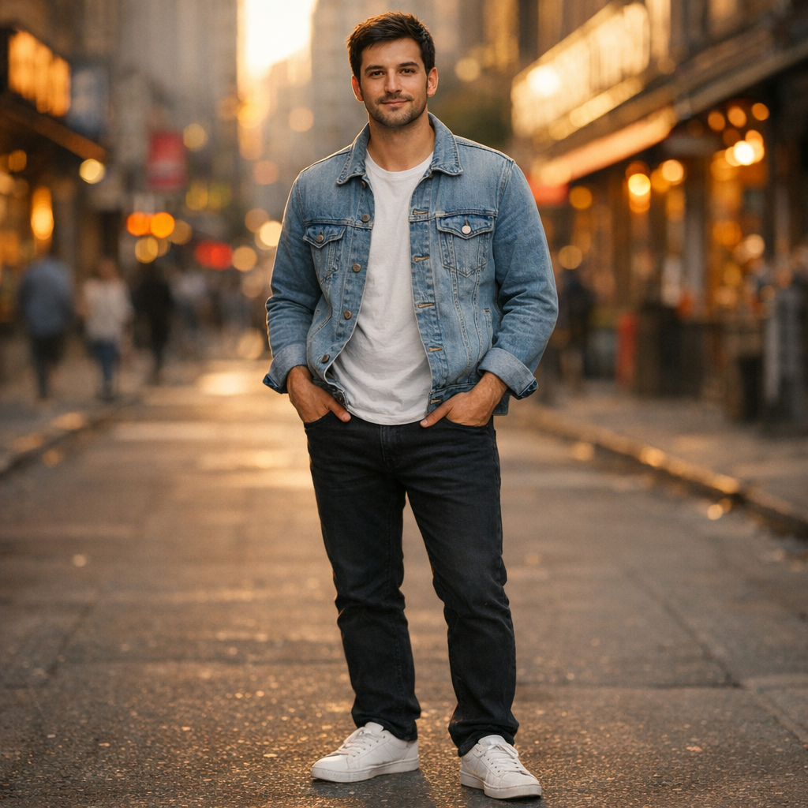
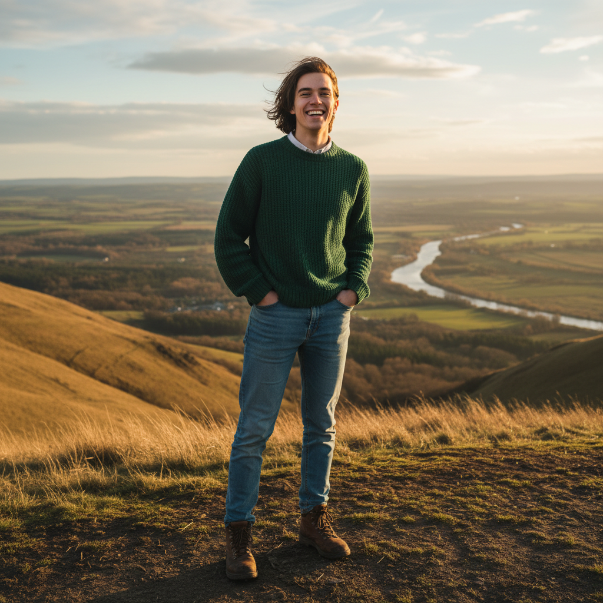
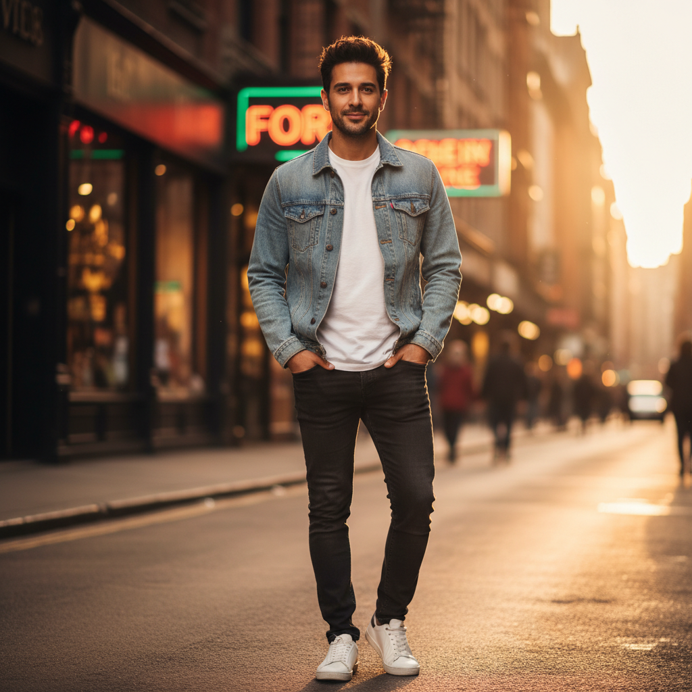
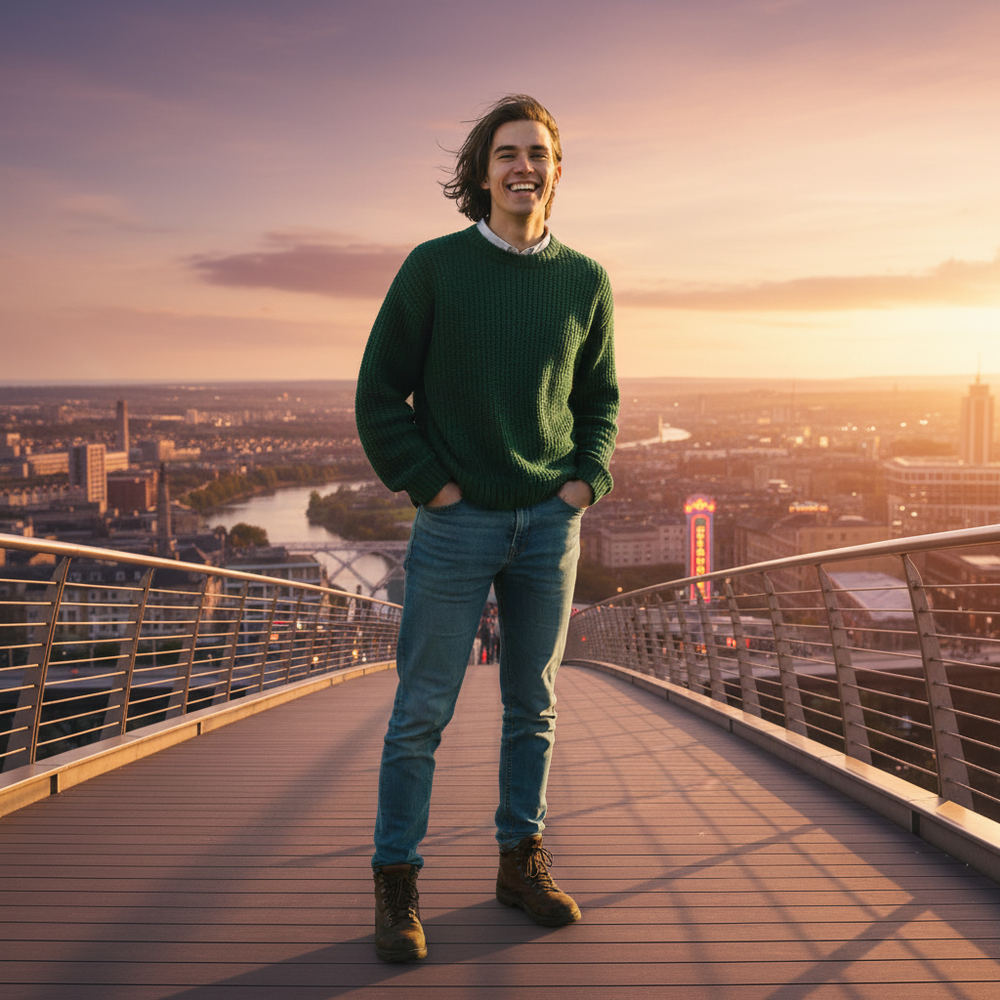

# Image MCP Preview and Edit Test

This document captures a manual test of the `image-mcp` tools for two models:

- `gpt-image-1.5`
- `gemini-2.5-flash-image`

The test is divided into two main phases:

1. Preview generation (`create`): a sparse prompt and a detailed person prompt for each model.
2. Edit composition (`edit`): combining the two previews per model into a new composed scene.

All generated images are stored under `tests/images/` and embedded below.

## 1. Preview Generation (Create)

### 1.1 GPT preview images

#### GPT sparse prompt

- Tool: `create`
- Model: `gpt-image-1.5`
- Prompt: `person`
- Size: `1024x1024`
- Output path: `tests/images/gpt-sparse.png`

Resulting image:

#### GPT detailed person prompt

- Tool: `create`
- Model: `gpt-image-1.5`
- Prompt:

  > A full body portrait of a person standing in a city street at golden hour, wearing casual modern clothes: light denim jacket, white t-shirt, black jeans, and white sneakers. The person has short dark hair, brown eyes, light stubble, and a soft smile. Background shows blurred city buildings, shop signs, and warm sunlight reflecting off windows. Cinematic lighting, shallow depth of field, soft shadows, and realistic skin texture. 1024x1024 high resolution, photographic, 35mm lens, eye-level angle.

- Size: `1024x1024`
- Output path: `tests/images/gpt-detailed-person.png`

Resulting image:

### 1.2 Gemini preview images

#### Gemini sparse prompt

- Tool: `create`
- Model: `gemini-2.5-flash-image`
- Prompt: `person`
- Size: `1024x1024`
- Output path: `tests/images/gemini-sparse.png`

Resulting image:

#### Gemini detailed person prompt

- Tool: `create`
- Model: `gemini-2.5-flash-image`
- Prompt:

  > A full body portrait of a person standing in a city street at golden hour, wearing casual modern clothes: light denim jacket, white t-shirt, black jeans, and white sneakers. The person has short dark hair, brown eyes, light stubble, and a soft smile. Background shows blurred city buildings, shop signs, and warm sunlight reflecting off windows. Cinematic lighting, shallow depth of field, soft shadows, and realistic skin texture. 1024x1024 high resolution, photographic, 35mm lens, eye-level angle.

- Size: `1024x1024`
- Output path: `tests/images/gemini-detailed-person.png`

Resulting image:

## 2. Edit Composition (Edit)

In this phase, both preview images for each model are provided as inputs to the `edit` tool. The goal is to compose a new scene that blends elements from the sparse and detailed prompts while maintaining the person’s appearance.

### 2.1 GPT composed scene

#### GPT edit call

- Tool: `edit`
- Model: `gpt-image-1.5`
- Input paths:

  - `tests/images/gpt-sparse.png`
  - `tests/images/gpt-detailed-person.png`

- Prompt:

  > Compose a new scene that combines the two input images: place the person from the detailed portrait in a new environment that blends visual elements from both images. The person is standing on a pedestrian bridge overlooking a city skyline at sunset, with subtle stylistic hints from the sparse preview image. Maintain the person’s appearance, lighting, and general outfit, but adjust the background to match the new scene. Cinematic, cohesive, and visually balanced.

- Size: `1024x1024`
- Output path: `tests/images/gpt-composed-scene.png`

Resulting image:

### 2.2 Gemini composed scene

#### Gemini edit call

- Tool: `edit`
- Model: `gemini-2.5-flash-image`
- Input paths:

  - `tests/images/gemini-sparse.png`
  - `tests/images/gemini-detailed-person.png`

- Prompt:

  > Compose a new scene that combines the two input images: place the person from the detailed portrait in a new environment that blends visual elements from both images. The person is standing on a pedestrian bridge overlooking a city skyline at sunset, with subtle stylistic hints from the sparse preview image. Maintain the person’s appearance, lighting, and general outfit, but adjust the background to match the new scene. Cinematic, cohesive, and visually balanced.

- Size: `1024x1024`
- Output path: `tests/images/gemini-composed-scene.png`

Resulting image:

---

This document can be used to manually re-run and verify `image-mcp` behavior across both models. Each step corresponds to a single MCP tool call with the parameters listed above.
