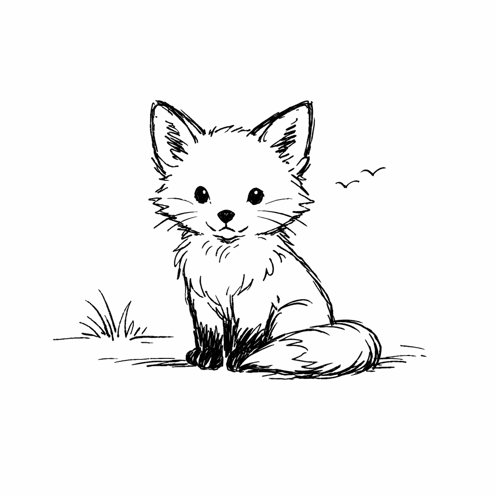
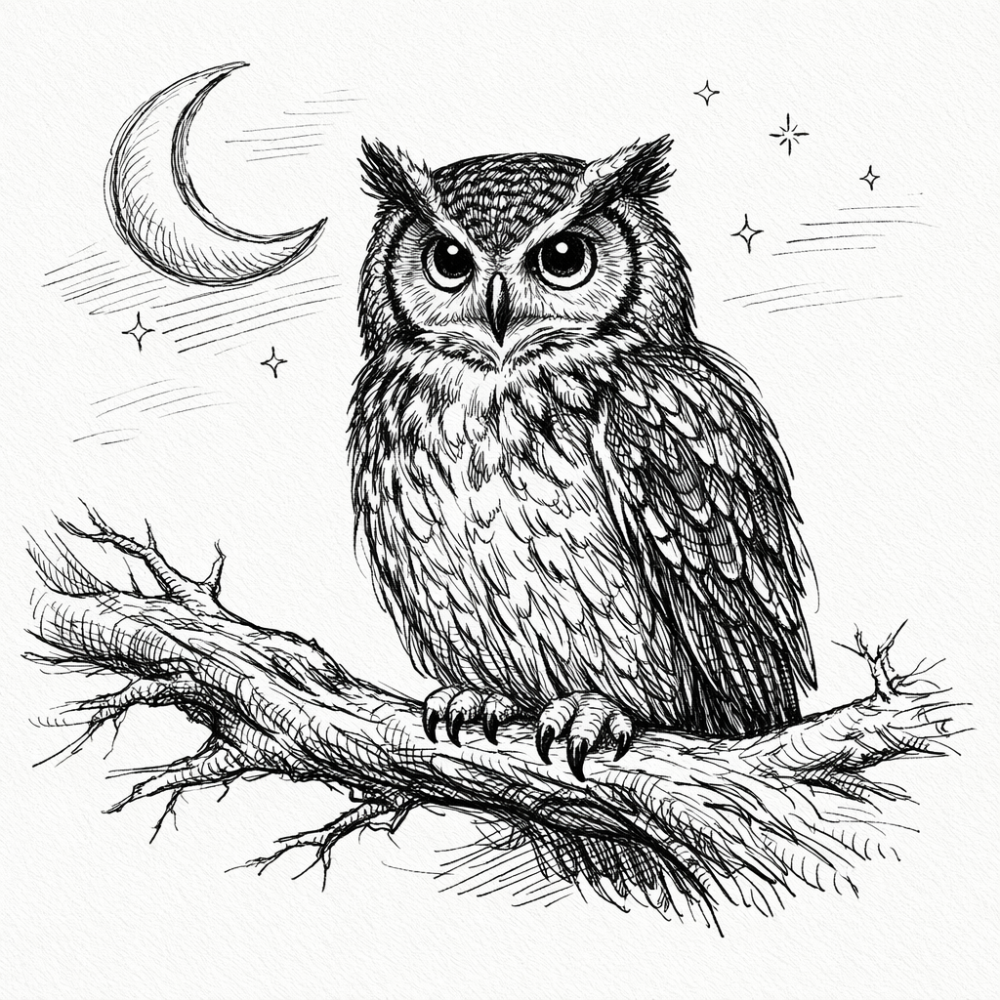
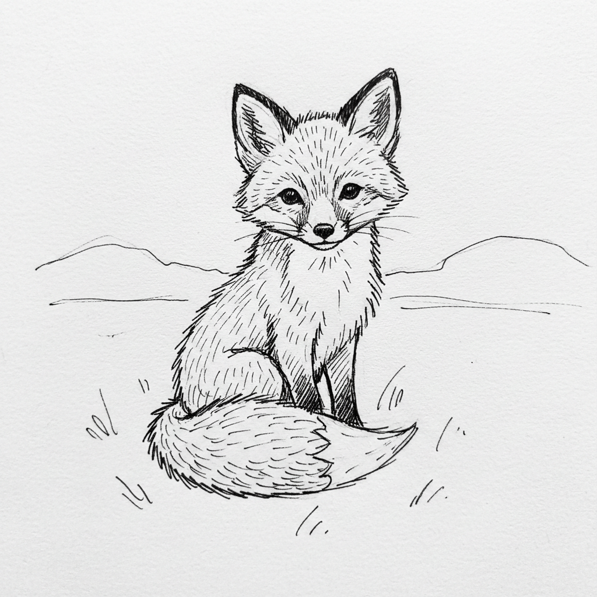
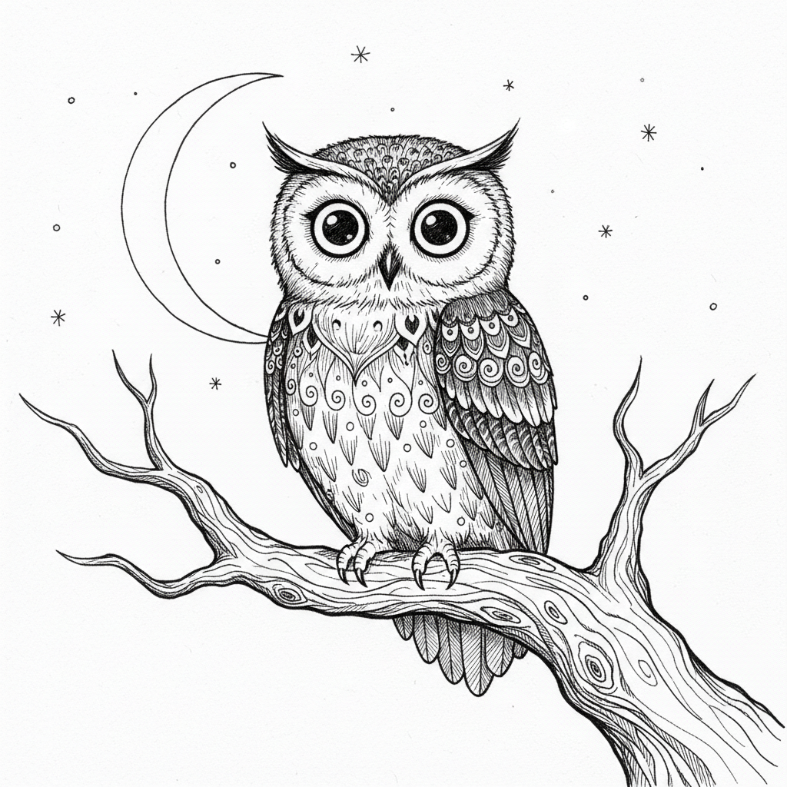
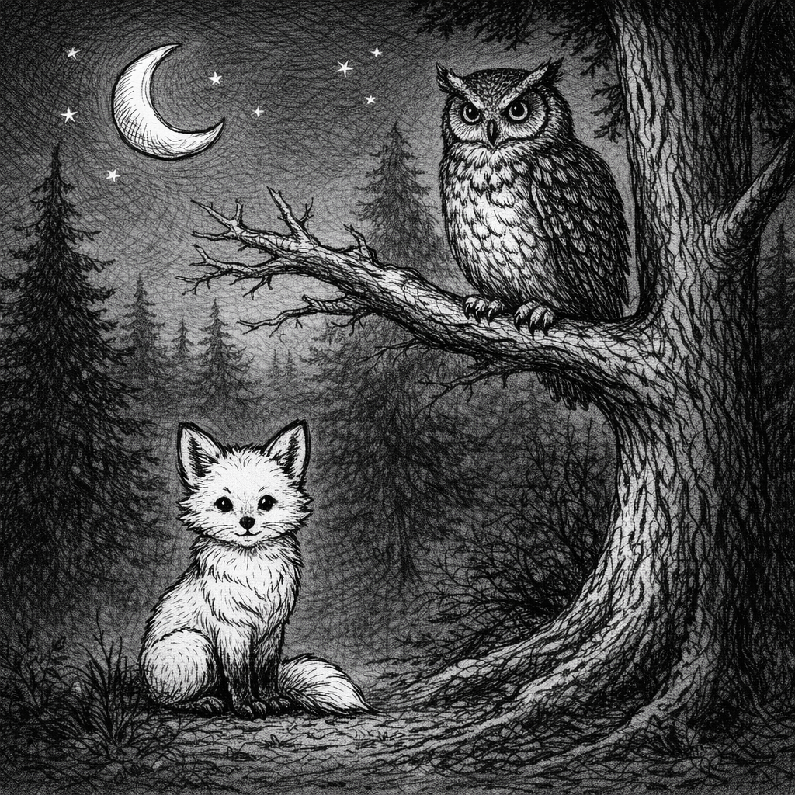
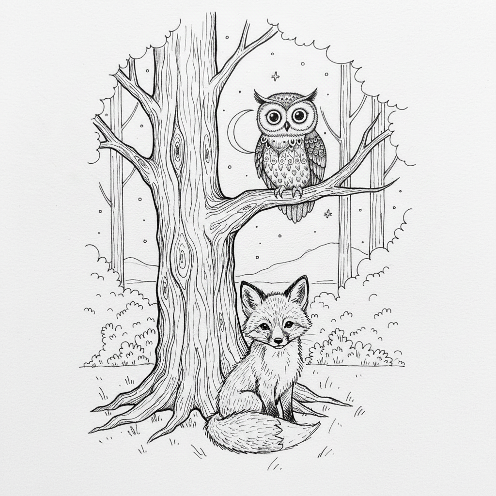

# Image MCP Two-Animals Hand-Drawing Test

This document captures a manual test of `image-mcp` where two different animals are generated per model in hand-drawn ink style and then composed into a single scene together.

Models covered:

- `gpt-image-1.5`
- `gemini-2.5-flash-image`

The test has two phases:

1. Preview generation (`create`): two distinct animals per model in hand-drawn style.
2. Edit composition (`edit`): both animals composed into one scene per model.

All generated images are stored under `tests/images/` and embedded below.

## 1. Preview Generation: Two Hand-Drawn Animals

### 1.1 GPT animal previews

#### GPT animal A – sparse sketch

- Tool: `create`
- Model: `gpt-image-1.5`
- Prompt: `simple hand-drawn sketch of a small fox sitting, minimal background, black ink lines on white paper`
- Size: `1024x1024`
- Output path: `tests/images/gpt-sparse-animal-a.png`

Resulting image:

#### GPT animal B – detailed ink drawing

- Tool: `create`
- Model: `gpt-image-1.5`
- Prompt:

  > A detailed hand-drawn illustration of an owl perched on a tree branch at night. The style is traditional ink drawing on white paper with visible line work and cross-hatching for shading. The owl has large expressive eyes, patterned feathers, and its wings relaxed at its sides. In the background, a crescent moon and a few stars are lightly suggested with simple lines. High-resolution scan of a pen-and-ink drawing, 1024x1024, no color fill, just black ink lines.

- Size: `1024x1024`
- Output path: `tests/images/gpt-detailed-animal-b.png`

Resulting image:

### 1.2 Gemini animal previews

#### Gemini animal A – sparse sketch

- Tool: `create`
- Model: `gemini-2.5-flash-image`
- Prompt: `simple hand-drawn sketch of a small fox sitting, minimal background, black ink lines on white paper`
- Size: `1024x1024`
- Output path: `tests/images/gemini-sparse-animal-a.png`

Resulting image:

#### Gemini animal B – detailed ink drawing

- Tool: `create`
- Model: `gemini-2.5-flash-image`
- Prompt:

  > A detailed hand-drawn illustration of an owl perched on a tree branch at night. The style is traditional ink drawing on white paper with visible line work and cross-hatching for shading. The owl has large expressive eyes, patterned feathers, and its wings relaxed at its sides. In the background, a crescent moon and a few stars are lightly suggested with simple lines. High-resolution scan of a pen-and-ink drawing, 1024x1024, no color fill, just black ink lines.

- Size: `1024x1024`
- Output path: `tests/images/gemini-detailed-animal-b.png`

Resulting image:

## 2. Edit Composition: Two Animals Together

In this phase, the two animal preview images per model (animal A and animal B) are provided as inputs to the `edit` tool. The goal is to create a single hand-drawn style scene where both animals appear together.

### 2.1 GPT two-animals scene

#### GPT two-animals edit call

- Tool: `edit`
- Model: `gpt-image-1.5`
- Input paths:

  - `tests/images/gpt-sparse-animal-a.png`
  - `tests/images/gpt-detailed-animal-b.png`

- Prompt:

  > Compose a new hand-drawn style scene featuring both animals together. Place the small fox from the simple sketch and the detailed owl from the ink illustration in the same forest setting at night. They should appear as two distinct animals on the same page, drawn in a cohesive black-ink hand drawing style, with the fox sitting near the base of the tree and the owl perched above on a branch. Preserve the line-art, cross-hatching, and monochrome ink-on-paper look.

- Size: `1024x1024`
- Output path: `tests/images/gpt-two-animals-composed.png`

Resulting image:

### 2.2 Gemini two-animals scene

#### Gemini two-animals edit call

- Tool: `edit`
- Model: `gemini-2.5-flash-image`
- Input paths:

  - `tests/images/gemini-sparse-animal-a.png`
  - `tests/images/gemini-detailed-animal-b.png`

- Prompt:

  > Compose a new hand-drawn style scene featuring both animals together. Place the small fox from the simple sketch and the detailed owl from the ink illustration in the same forest setting at night. They should appear as two distinct animals on the same page, drawn in a cohesive black-ink hand drawing style, with the fox sitting near the base of the tree and the owl perched above on a branch. Preserve the line-art, cross-hatching, and monochrome ink-on-paper look.

- Size: `1024x1024`
- Output path: `tests/images/gemini-two-animals-composed.png`

Resulting image:

---

This document can be used to manually re-run and verify `image-mcp` behavior when composing two hand-drawn animals per model into a single ink-style scene. Each step corresponds to a single MCP tool call with the parameters listed above.
