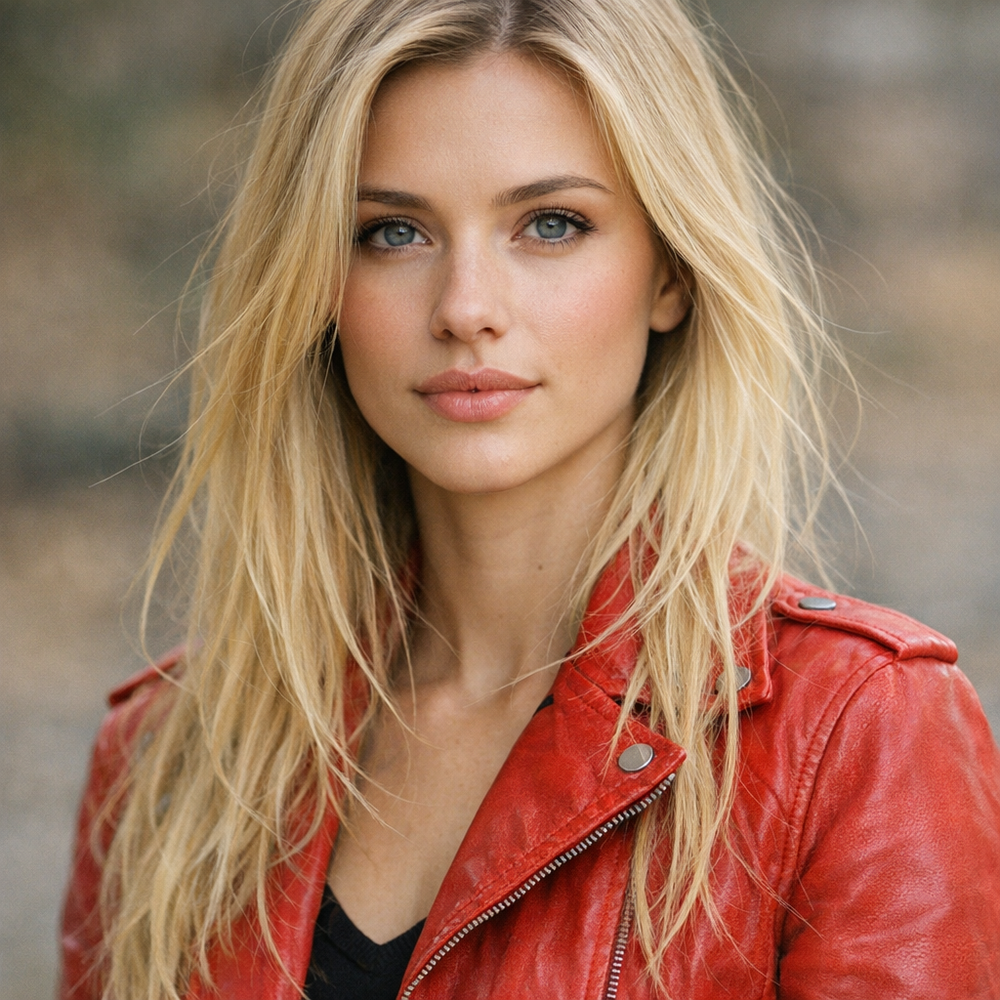
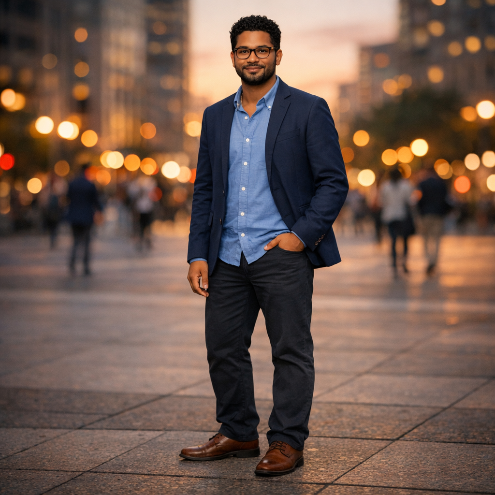
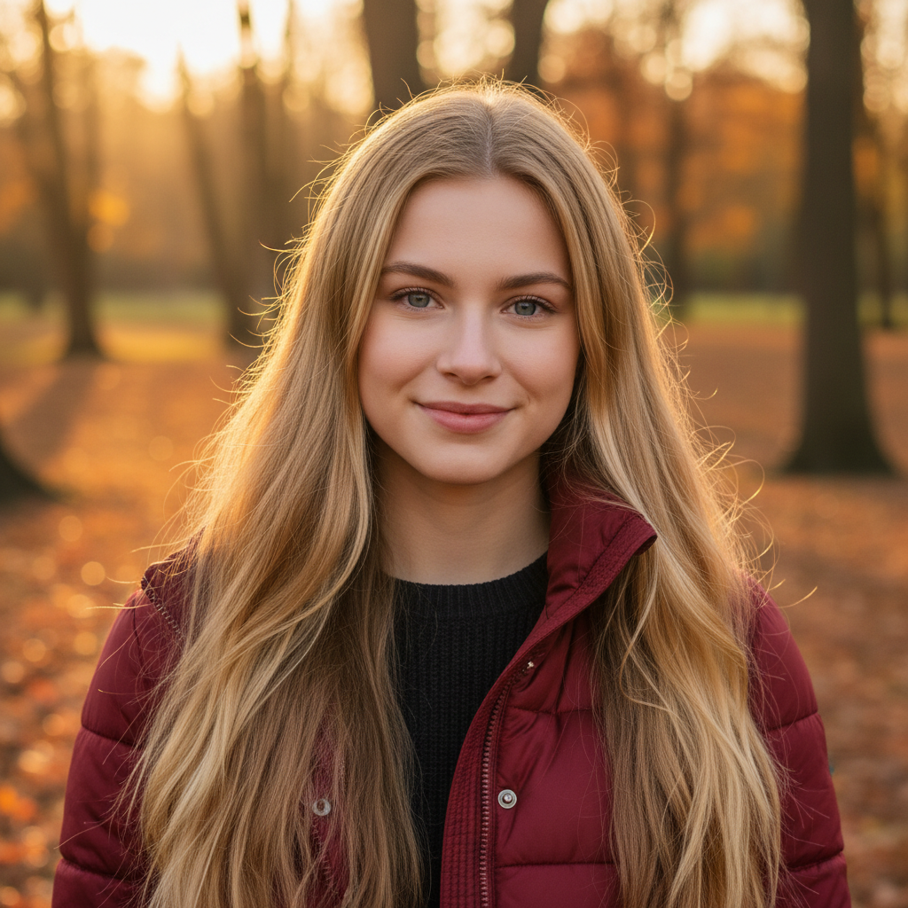
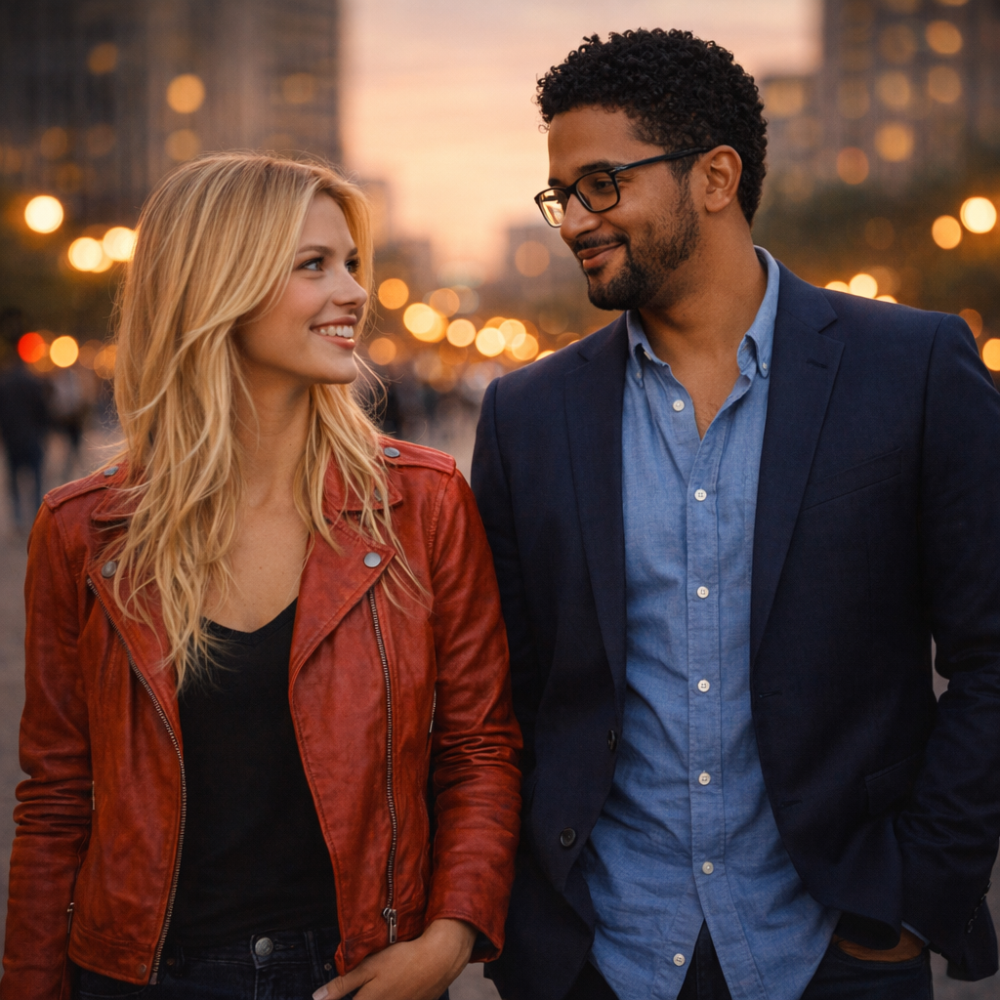
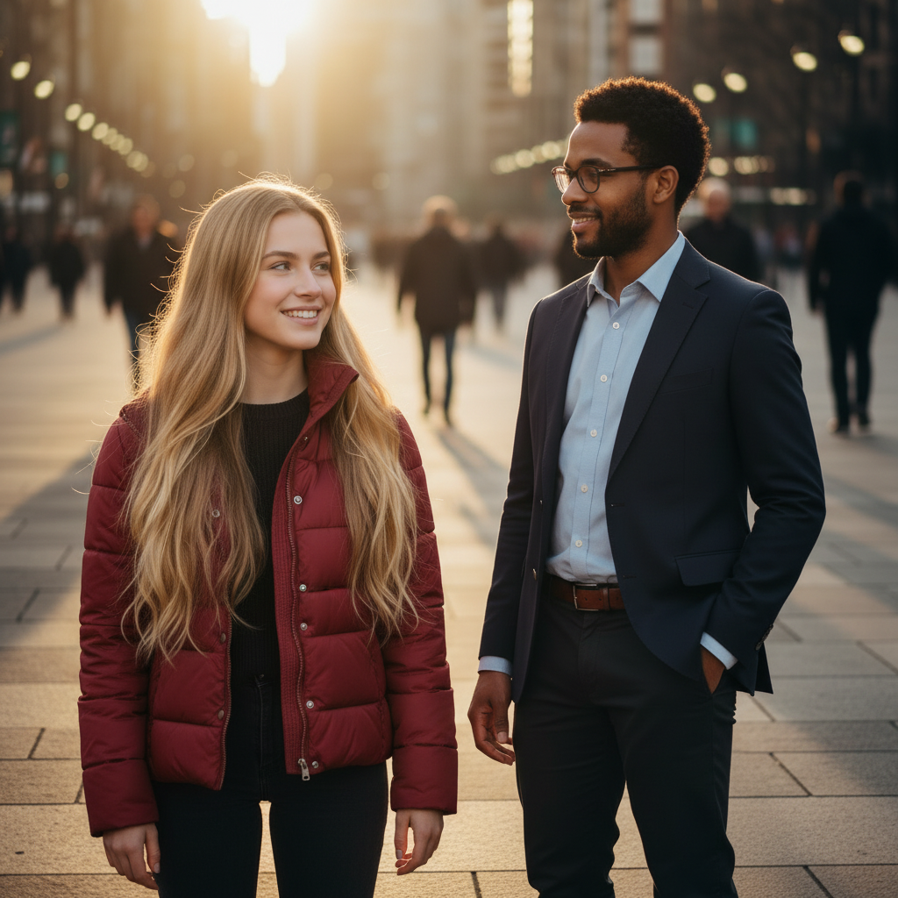

# Image MCP Two-Person Composition Test

This document captures a manual test of `image-mcp` where two different people are generated per model and then composed into a single scene together.

Models covered:

- `gpt-image-1.5`
- `gemini-2.5-flash-image`

The test has two phases:

1. Preview generation (`create`): two distinct people per model.
2. Edit composition (`edit`): both people composed into one two-person scene per model.

All generated images are stored under `tests/images/` and embedded below.

## 1. Preview Generation: Two Different People

### 1.1 GPT previews

#### GPT person A – sparse prompt

- Tool: `create`
- Model: `gpt-image-1.5`
- Prompt: `portrait of a person with long blonde hair wearing a red jacket`
- Size: `1024x1024`
- Output path: `tests/images/gpt-sparse-person-a.png`

Resulting image:

#### GPT person B – detailed prompt

- Tool: `create`
- Model: `gpt-image-1.5`
- Prompt:

  > A full body portrait of a second person standing in an urban plaza at sunset. This person is distinctly different from the first: short black curly hair, medium brown skin tone, wearing a navy blazer over a light blue shirt, dark chinos, and brown leather shoes. They have glasses, a trimmed beard, and a confident relaxed posture with one hand in their pocket. The background shows soft bokeh of city lights and people walking in the distance. Cinematic lighting, realistic textures, photographic, 35mm lens, eye-level angle, 1024x1024 resolution.

- Size: `1024x1024`
- Output path: `tests/images/gpt-detailed-person-b.png`

Resulting image:

### 1.2 Gemini previews

#### Gemini person A – sparse prompt

- Tool: `create`
- Model: `gemini-2.5-flash-image`
- Prompt: `portrait of a person with long blonde hair wearing a red jacket`
- Size: `1024x1024`
- Output path: `tests/images/gemini-sparse-person-a.png`

Resulting image:

#### Gemini person B – detailed prompt

- Tool: `create`
- Model: `gemini-2.5-flash-image`
- Prompt:

  > A full body portrait of a second person standing in an urban plaza at sunset. This person is distinctly different from the first: short black curly hair, medium brown skin tone, wearing a navy blazer over a light blue shirt, dark chinos, and brown leather shoes. They have glasses, a trimmed beard, and a confident relaxed posture with one hand in their pocket. The background shows soft bokeh of city lights and people walking in the distance. Cinematic lighting, realistic textures, photographic, 35mm lens, eye-level angle, 1024x1024 resolution.

- Size: `1024x1024`
- Output path: `tests/images/gemini-detailed-person-b.png`

Resulting image:

## 2. Edit Composition: Two Persons Together

In this phase, the two preview images per model (Person A and Person B) are provided as inputs to the `edit` tool. The goal is to create a single scene where both people appear together as distinct individuals.

### 2.1 GPT two-person scene

#### GPT edit call

- Tool: `edit`
- Model: `gpt-image-1.5`
- Input paths:

  - `tests/images/gpt-sparse-person-a.png`
  - `tests/images/gpt-detailed-person-b.png`

- Prompt:

  > Compose a new scene featuring both people together. Place the blonde-haired person in the red jacket and the second person with short black curly hair and navy blazer standing side by side in the same urban plaza at sunset. They should appear as two distinct individuals interacting naturally, for example talking or standing together, with consistent lighting and perspective. Maintain their individual appearances from the source images and create a cohesive, cinematic two-person scene.

- Size: `1024x1024`
- Output path: `tests/images/gpt-two-person-composed.png`

Resulting image:

### 2.2 Gemini two-person scene

#### Gemini edit call

- Tool: `edit`
- Model: `gemini-2.5-flash-image`
- Input paths:

  - `tests/images/gemini-sparse-person-a.png`
  - `tests/images/gemini-detailed-person-b.png`

- Prompt:

  > Compose a new scene featuring both people together. Place the blonde-haired person in the red jacket and the second person with short black curly hair and navy blazer standing side by side in the same urban plaza at sunset. They should appear as two distinct individuals interacting naturally, for example talking or standing together, with consistent lighting and perspective. Maintain their individual appearances from the source images and create a cohesive, cinematic two-person scene.

- Size: `1024x1024`
- Output path: `tests/images/gemini-two-person-composed.png`

Resulting image:

---

This document can be used to manually re-run and verify `image-mcp` behavior when composing two distinct people per model into a single scene. Each step corresponds to a single MCP tool call with the parameters listed above.
